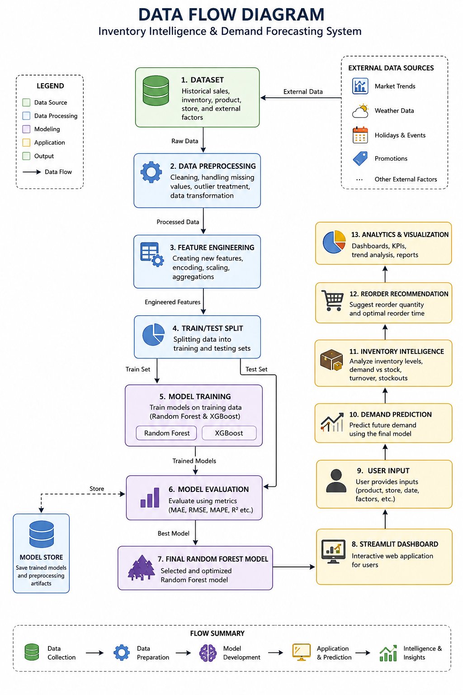
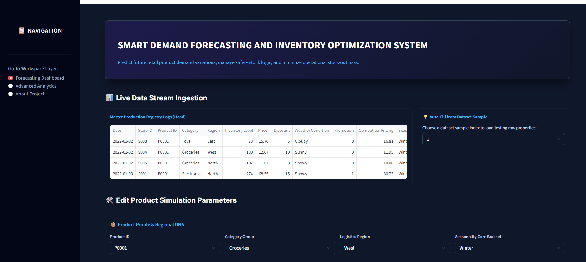
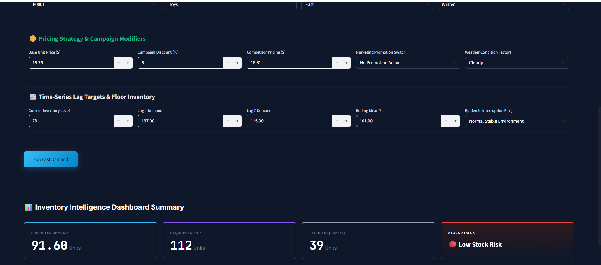
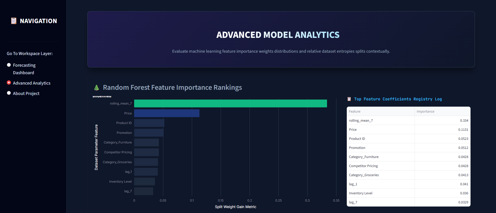
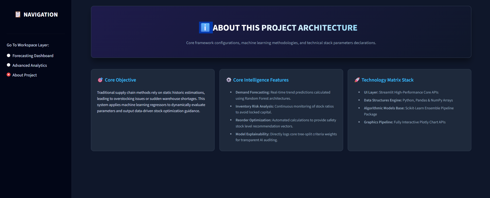

# Smart Demand Forecasting and Inventory Optimization System

## Project Overview

The Smart Demand Forecasting and Inventory Optimization System is a machine learning-powered decision support application designed to predict product demand and optimize inventory management. The system leverages historical sales data, pricing information, inventory levels, promotional activities, weather conditions, and regional factors to forecast future demand and generate intelligent inventory recommendations.

The project combines Machine Learning, Data Analytics, and Interactive Visualization through a modern Streamlit dashboard to assist businesses in minimizing stockouts, reducing overstock situations, and improving inventory planning efficiency.

---

## Key Features

- Demand Forecasting using Machine Learning
- Inventory Intelligence Dashboard
- Reorder Quantity Recommendations
- Stock Risk Assessment
- Advanced Feature Importance Analysis
- Interactive Streamlit Web Application
- Real-Time Parameter Simulation
- Business-Oriented Visual Analytics

---

## System Architecture



---

## Dashboard Screenshots

### Dashboard Home



---

### Demand Prediction & Inventory Optimization



---

### Advanced Analytics



---

### About Project



---

## Machine Learning Workflow

1. Data Collection
2. Data Preprocessing
3. Feature Engineering
4. Train-Test Split
5. Model Training
   - Random Forest Regressor
   - XGBoost Regressor
6. Model Evaluation
7. Best Model Selection
8. Demand Prediction
9. Inventory Optimization
10. Analytics and Reporting

---

## Technology Stack

### Programming Language
- Python

### Machine Learning
- Scikit-Learn
- XGBoost

### Data Processing
- Pandas
- NumPy

### Visualization
- Plotly
- Matplotlib

### Web Framework
- Streamlit

---

## Model Performance

The project evaluates multiple regression models using:

- MAE (Mean Absolute Error)
- RMSE (Root Mean Squared Error)
- MAPE (Mean Absolute Percentage Error)
- R² Score

The Random Forest model was selected as the final forecasting model based on overall predictive performance.

---

## Project Structure

```text
Smart-Demand-Forecasting-and-Inventory-Optimization-System
│
├── app.py
├── rf_model.pkl
├── xgboost_demand_model.pkl
├── feature_columns.pkl
├── label_encoders.pkl
├── demand_forecasting.csv
├── preprocessed_demand_forecasting_data.csv
├── requirements.txt
├── README.md
│
├── images
│   ├── architecture.png
│   ├── dashboard_home.png
│   ├── prediction_and_results.png
│   ├── analytics.png
│   └── about_project.png
│
├── analysis.ipynb
├── machine_learning.ipynb
└── visualization.ipynb
```

## Installation

### Clone Repository

```bash
git clone https://github.com/sydavali/Smart-Demand-Forecasting-and-Inventory-Optimization-System.git
```

### Navigate to Project Folder

```bash
cd Smart-Demand-Forecasting-and-Inventory-Optimization-System
```

### Install Dependencies

```bash
pip install -r requirements.txt
```

### Run Application

```bash
streamlit run app.py
```

---

## Future Enhancements

- Real-Time Data Integration
- Cloud Deployment
- Automated Inventory Alerts
- Multi-Warehouse Support
- Deep Learning Forecasting Models
- ERP Integration

---

## Author

**Shaik Sydavali**

AI & ML Engineering Student

Focused on Data Science, Machine Learning, and Intelligent Decision Support Systems.
